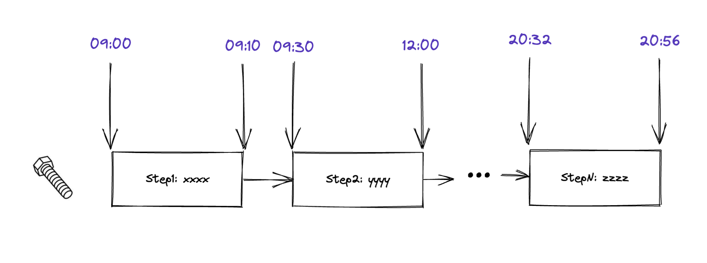

# Design Doc

## Overview

Each Apple part goes through several processes and consumes a certain amount of time within and between each process:



For each part, the time spent within each step, the time spent between each step, and the number of steps to go through are inconsistent.
Let's say our input body contains only one part, containing $N$ steps from step $S_0$ to step $S_{N-1}$. We need to count the number of parts for each time interval from step $S_x$ to step $S_y$ ($0 \leq x < y \leq {N-1}$).
Time interval can be specifed, default set to 24 Hours.

## Input Format

The input is a group of `.csv` files, the naming convention for each file is `raw-data-download-{{PROJECT_CODE}}-{{SHORTEN_STEP_NAME}}` such as `raw-data-download-N199-Housing TI-LDG-2d-bc-le.csv`.  
And a a file that provides a mapping from shorten step name to full step name. For example:

```json
{
    "2d-bc-le": "2D Barcode LE", 
}
```

There are some situations need to be considered carefully:

1. The number of fields in each csv is inconsistent.
2. The data corresponding to a certain serial number may be missing at some steps.

## Output Format

The output should also be a `.csv` file. The format like this:

| ProjectCode | FromStep | ToStep | 1 | 2 | 3 | 4 | 5 | 6 | 7 | $ > 7$ |
| :-: | :-: | :-: | :-: | :-: | :-: | :-: | :-: | :-: | :-: | :-: |
| N199 | CNC Input | EPIC Treatment | 99 | 108 | 22 | 45 | 19 | 32 | 15 | 99 |
| N199 | EPIC Treatment | Insert Molding | 18 | 35 | 99 | 108 | 45 | 28 | 32 | 69 |
